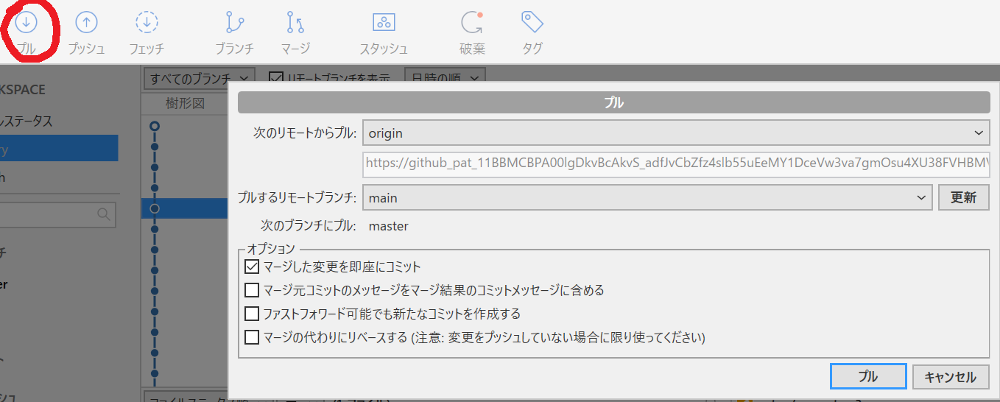
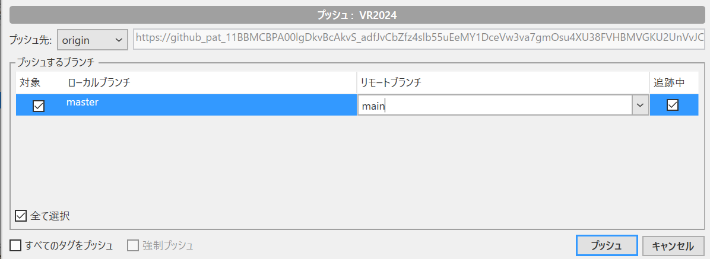
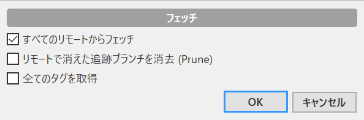
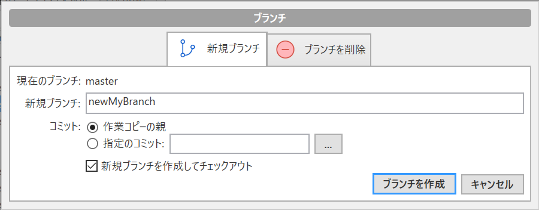

# ファイル同期のやり方
## 用語解説
### リポジトリ
ファイルの状態を保存する場所のこと。自分のpc上の配置する「ローカルリポジトリ」とGitHub上に置いて共有する「リモートリポジトリ」がある。

### コミット
ファイルの更新を行ったあと、ローカルリポジトリにその更新を反映すること。リモートリポジトリには何も変更を加えない。
反映したい更新は「ステージ」することで選ぶことができる。

### プル pull
指定したリモートリポジトリの更新内容を自分のローカルリポジトリに反映する。
いろいろ設定できるが、基本は何も変えずにプルしてよい。

### プッシュ push
指定したリモートリポジトリに自分のローカルリポジトリの更新内容を反映する。プルの逆。
「対象」にチェックを入れ、リモートブランチ(後述)を選択する。基本的に**mainには直接プッシュしないこと**。自分のブランチを作ってそこにプッシュしてください。

### フェッチ fetch
リモートリポジトリすべてを調べてどのような更新が行われているかを確認する(が、自分のローカル環境は何も変えない)。
何も変えずにフェッチしてよい。他の人がファイル上げたって言ってるのに反映されないなーというときや、プッシュやプルをする前にとりあえずやっておくとよい。

### ブランチ branch
自分用のリモートリポジトリのこと。また自分用のリモートリポジトリを新しく作ること。基本的にここにpushして、GitHub側からmainにマージ(後述)を行うことで全体にその変化を反映させる。全員自分用のブランチを一つ持っておくことを推奨。

### マージ merge
複数のブランチの変更をまとめること。branchの逆。
進捗がより進んでいるブランチAとそうではないブランチBがあったとして、ブランチAをブランチBにマージすることでブランチAの進捗をブランチBに反映することができる。ブランチAとブランチBが同じファイルに異なる変更を加えている場合はコンフリクト(衝突)といい、どちらの変更をどのように反映するか選択しなければならない。自分用のブランチからmainにマージすることがほとんどだが、基本的に**Sourcetreeからマージは行わない**。代わりにGitHubからプルリクエストを行い、権限を持つ人(全員)がそれをマージする。

### スタッシュ stash
ローカルな変更を一時的に退避させる場所のこと。作業中に突然他のブランチに切り替えるなどの場合に使うとされているが、利用頻度は低い。覚えなくていいと思う。

---
## 変更反映のやり方
初回の場合は「ブランチ」から自分用のブランチを作成してください。

まず画面左上にある「コミット」ボタンを押して反映したいファイルを選択し、ステージし、コミットします。

～～以下工事中～～
